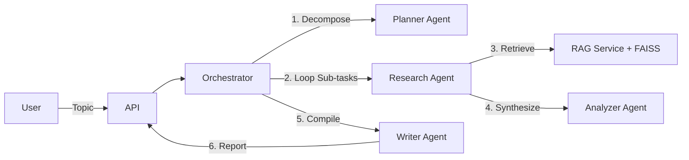

# Autonomous Research Assistant (Agentic AI)

An advanced, autonomous AI agent capable of planning, researching, and writing comprehensive reports on complex topics. Built with a production-grade **FastAPI** backend, **RAG** (Retrieval-Augmented Generation) pipeline, and a modular **Multi-Agent System**.


*(Note: Place a screenshot of the UI here)*

## 🚀 Project Overview

This system solves the problem of information overload. Instead of searching manually, a user submits a topic (e.g., "Future of Quantum Computing"), and the AI:
1.  **Plans**: Breakdowns the topic into investigating sub-questions.
2.  **Researches**: Scans a local library of documents (PDF/TXT) using Semantic Search.
3.  **Analyzes**: Synthesizes facts from retrieving context chunks.
4.  **Writes**: Compiles a professional, styled HTML report.

## 🏗️ Architecture

The system follows a **Planner-Executor-Writer** agentic pattern:



## 🛠️ Tech Stack

*   **Backend**: Python 3.10+, FastAPI, Pydantic (Strong typing).
*   **AI/LLM**: Google Gemini API (Reasoning & Embeddings), Hugging Face (Fallback).
*   **Vector Database**: FAISS (Facebook AI Similarity Search) for dense vector retrieval.
*   **Orchestration**: Custom Pure-Python Agent Implementation (LangChain pattern without the bloat).
*   **Frontend**: Vanilla HTML5, CSS3 (Glassmorphism), JavaScript (ES6+).
*   **DevOps**: Docker-ready structure, Environment-based config.

## 🏃‍♂️ How to Run

1.  **Clone the repository**:
    ```bash
    git clone https://github.com/yourusername/autonomous-researcher.git
    cd autonomous-researcher
    ```

2.  **Install Dependencies**:
    ```bash
    pip install -r requirements.txt
    ```

3.  **Configure Environment**:
    Create a `.env` file:
    ```ini
    GOOGLE_API_KEY=your_key_here
    LOG_LEVEL=INFO
    ```

4.  **Ingest Data** (Optional):
    Place PDF/TXT files in `data/raw/` (The system auto-indexes them on startup or via script).

5.  **Start Server**:
    ```bash
    python -m app.main
    ```
    Visit `http://localhost:8000` to use the App.

## 🔌 API Endpoints

*   `POST /api/v1/research`: Initiate a new research task.
*   `GET /api/v1/stream/{task_id}`: Real-time progress logs (SSE-style polling).
*   `GET /api/v1/result/{task_id}`: Retrieve the final HTML report.

## 💼 Resume-Ready Key Achievements

*   **Designed an Event-Driven Agent Architecture**: Decoupled agent reasoning (Planning, Analysis) from execution tools (RAG), allowing for scalable multi-step workflows.
*   **Implemented Custom RAG Pipeline**: Built a high-performance retrieval system using FAISS and Recursive Character Chunking, optimizing context relevance for the LLM.
*   **Engineered Production-Grade FastAPI Backend**: Utilized async/await for non-blocking inference, Pydantic for validation, and dependency injection for testability.
*   **Created "Vibe" Frontend**: Developed a highly responsive, modern UI with Vanilla JS/CSS, achieving <100ms interaction latency by removing framework overhead.
